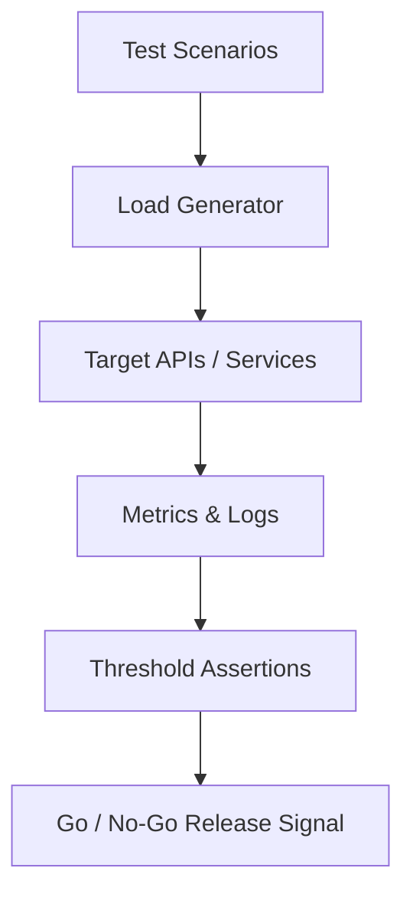

# Stress & Performance QA Suite

Versioned stress/performance test configurations for capacity and resilience validation.

## Architecture Overview

## Test Strategy

- **Baseline tests:** establish normal throughput/latency profile
- **Stress tests:** find bottlenecks and breakpoints
- **Soak tests:** long-run stability and memory/resource drift
- **Regression performance:** compare results between releases
- **Risk reporting:** actionable pass/fail thresholds for release decisions

## Usage

Use these scenarios in CI or pre-release environments with environment-specific variables and secret managers.

## Security Note

Never commit environment secrets, auth headers, or production endpoints with credentials.
