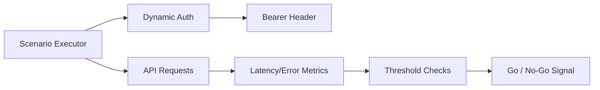

# Stress & Performance QA Suite (k6)


Professional load/stress suite for API reliability validation with dynamic authentication, configurable endpoints, and scenario-based traffic models.

## Scenario Models

- **Ramp-up load** (`ramping-arrival-rate`): gradually increases RPS to validate scaling behavior.
- **Spike test** (`ramping-vus`): sudden traffic surge to expose saturation and recovery weaknesses.
- **Soak test** (`constant-vus`): sustained load to detect memory/resource leaks over time.

## Architecture



## Files

- `k6-load-stress.js`: main k6 script with ramp-up, spike, and soak scenarios.

## Run

```bash
# Basic run (no auth)
k6 run k6-load-stress.js

# Full env-driven run with dynamic token retrieval
BASE_URL=https://api.example.com \
AUTH_ENABLED=true \
AUTH_URL=https://api.example.com/auth/token \
API_PATH=/v1/orders/search \
CLIENT_ID=demo-client \
CLIENT_SECRET=demo-secret \
k6 run k6-load-stress.js
```

## Environment Variables

- `BASE_URL`: API host (default: `https://api.example.com`)
- `AUTH_ENABLED`: `true|false` (default: `false`)
- `AUTH_URL`: token endpoint URL
- `API_PATH`: target path for load requests
- `CLIENT_ID`, `CLIENT_SECRET`: auth credentials (from CI/local secret store)
- `REQUEST_TIMEOUT`: per-request timeout (default: `30s`)

## Quality Gates (Thresholds)

- `http_req_failed < 2%`
- `p95 < 1200ms`
- `p99 < 2000ms`
- `checks > 98%`

## Security Note

Do not commit real URLs, credentials, or tokens. Keep all sensitive values in runtime environment variables or secret managers.
